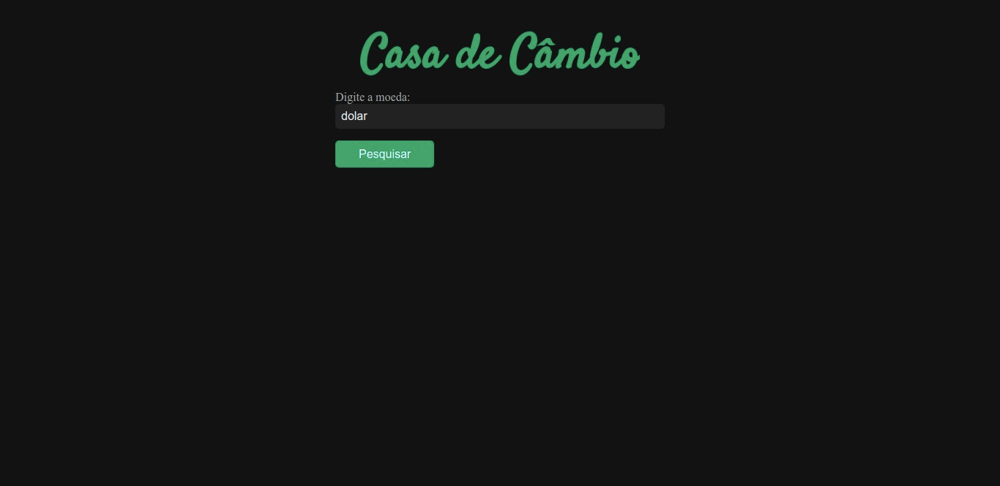

<h1 align="center">
  
</h1>

<h3 align="center">
  Curso realizado na Trybe - Edu Souza o/
</h3>

<blockquote align="center">“A alegria, quando acompanhada de virtudes, é o combustível da alma e do espírito - Ivan Teorilang”</blockquote>

<h4 align="center">
  Repositório - Casa de cambio
</h4>

 

  &nbsp;
  &nbsp;
  

  <a href="#rocket-Sobre-o-projeto">Sobre o projeto</a>&nbsp; &nbsp; |&nbsp; &nbsp;
  <a href="#postbox-Entrega"">Entrega</a>&nbsp; &nbsp; |&nbsp; &nbsp;
  <a href="#unlock-Licença">Licença</a>

## :rocket: Sobre o projeto

#### Casa de cambio

Você vai implementar uma casa de cambio web.

#### Screenshots:

   &nbsp;

## :postbox: Entrega

#### :clipboard: Requisitos

- 
<a href="#1"> :pushpin: 1.</a> Crie um campo para de busca.

- 
<a href="#2"> :pushpin: 2.</a> Crie um botão para pesquisar.

- 
<a href="#3"> :pushpin: 3.</a> Liste as moedas.

- 
<a href="#4"> :pushpin: 4.</a> Estilize a página.

### Concluído :rocket:

Acesse o deploy do projeto [aqui](https://edusouza-programmer.github.io/Trybe_Projeto_9-3_Edu_Souza/).

#
## :unlock: Licença

Este projeto está licenciado sob a Licença MIT - consulte [LICENSE](https://opensource.org/licenses/MIT) para maiores detalhes.
